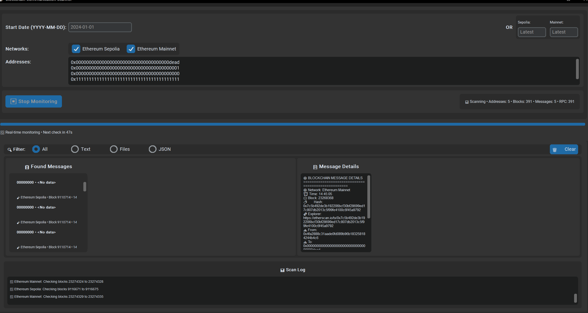
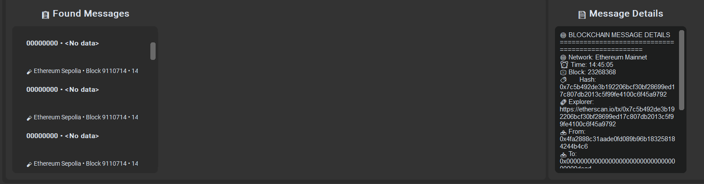
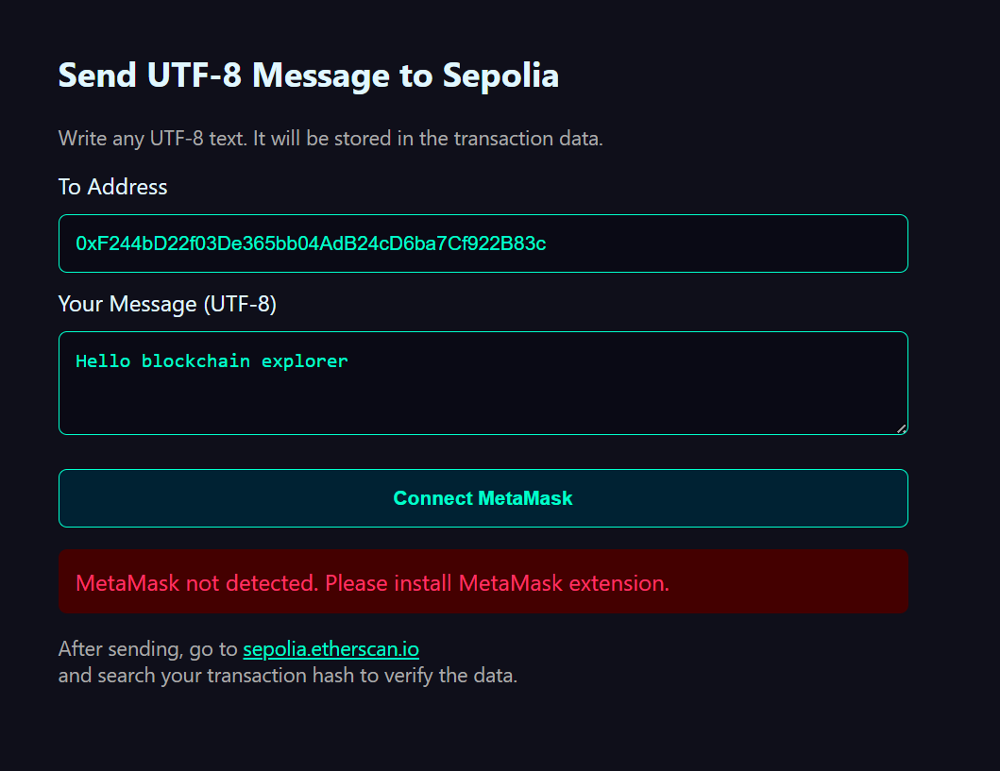
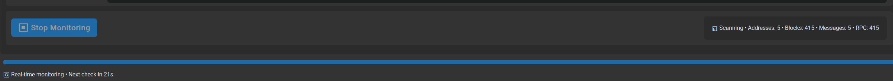

# Blockchain Communication Tools

A proof-of-concept toolkit for using Ethereum blockchain as a decentralized communication medium. This project demonstrates how blockchain transaction data can be repurposed for messaging and file storage beyond traditional token transfers.

## 🚀 Overview

This toolkit consists of two main components:
- **Blockchain Scanner**: Python GUI application for monitoring and discovering messages stored in blockchain transactions
- **Minimal Writer**: Browser-based tool for sending UTF-8 messages directly to the blockchain

The system treats the blockchain as a "carrier wave" for communication - similar to how CB radio or early ICQ worked, but in a decentralized, permanent, and censorship-resistant manner.

## 📸 Screenshots


*Main scanner interface showing multi-network monitoring*


*Detailed view of discovered blockchain messages*


*Simple web-based message sender*


*Real-time blockchain monitoring in action*

## 🛠️ Features

### Blockchain Scanner (`blockchain_scanner.py`)
- **Multi-Network Support**: Ethereum Mainnet and Sepolia testnet
- **Real-time Monitoring**: Continuous scanning for new messages
- **Smart Data Processing**: Handles various formats (UTF-8, Base64, LZ-compressed, JSON)
- **ETH_FILE_DATA Support**: Special format for file storage on blockchain
- **Message Filtering**: Filter by content type (text, files, JSON)
- **Persistent Cache**: Saves discovered messages between sessions
- **Rate Limiting**: Respects RPC endpoint limits
- **Batch Processing**: Efficient scanning with configurable batch sizes

### Minimal Writer (`minimalwrite.html`)
- **MetaMask Integration**: Direct wallet connectivity
- **UTF-8 Support**: Send any text including emojis and special characters
- **Gas Estimation**: Automatic transaction cost calculation
- **Network Detection**: Ensures correct network selection
- **Real-time Status**: Transaction confirmation and error handling
- **CORS Requirements**: Must be served via live server (not file://)
- **No External Dependencies**: Works with any modern browser and MetaMask

## 🔧 Installation

### Prerequisites
- Python 3.8+
- MetaMask browser extension
- Sepolia testnet ETH for transactions

### Python Dependencies
```bash
pip install customtkinter requests lzstring
```

### Setup
1. Clone this repository
2. Install Python dependencies
3. Run the scanner: `python blockchain_scanner.py`
4. For the writer:
   - **Live Server Required**: Due to CORS restrictions, `minimalwrite.html` must be served via HTTP server
   - **Python**: `python -m http.server 8000` then open `http://localhost:8000/minimalwrite.html`
   - **VS Code**: Use "Live Server" extension
   - **Node.js**: `npx serve .` or `npx http-server`

### Pre-compiled Versions
- **Windows Executable**: A compiled .exe version of the scanner is available in releases for users who prefer not to install Python

## 📖 Usage

### Discovering Messages
1. Launch the blockchain scanner
2. Enter Ethereum addresses to monitor (default addresses included)
3. Select networks (Sepolia recommended for testing)
4. Choose scan method:
   - **Date-based**: Scan from specific date
   - **Block-based**: Scan from specific block numbers
   - **Real-time**: Monitor for new transactions
5. View discovered messages in the filtered list
6. Click messages for detailed analysis

### Sending Messages
1. **Start a live server** (required due to CORS):
   - Python: `python -m http.server 8000`
   - VS Code: Use "Live Server" extension  
   - Node.js: `npx serve .`
2. Open `http://localhost:8000/minimalwrite.html` in your browser
3. Connect MetaMask wallet
4. Ensure you're on Sepolia testnet
5. Enter recipient address and message
6. Send transaction via MetaMask

## 🎯 Common Use Cases

### Discovered in the Wild
During testing on Sepolia testnet, we found various experimental messages:
- Simple greetings ("hello", "test")
- Random phrases ("im luna", "blockchain explorer")
- Experimental data formats
- File storage attempts

### Potential Applications
- **Decentralized Messaging**: Censorship-resistant communication
- **Proof of Existence**: Timestamp documents on blockchain
- **Dead Drop Systems**: Asynchronous message exchange
- **Blockchain Guestbooks**: Permanent visitor logs
- **Research Data**: Immutable scientific observations

## ⚠️ Important Considerations

### Privacy and Permanence
- **All data is PUBLIC**: Anyone can read blockchain transactions
- **Data is PERMANENT**: Cannot be deleted or modified
- **No encryption included**: Messages are stored as plain text
- **Transaction costs**: Each message requires gas fees

### Cost Implications
- **Sepolia**: Free testnet ETH required
- **Mainnet**: Real ETH costs (can be expensive for large data)
- **Gas optimization**: Smaller messages cost less

### Legal and Ethical
- Respect local laws regarding data storage
- Do not store illegal content
- Consider data privacy regulations
- Be mindful of blockchain bloat

## 🔍 Data Formats Supported

### Standard Text
- UTF-8 encoded messages
- Emoji and special characters
- Multiple languages

### Compressed Data
- LZ-String compression
- Base64 encoding
- Binary data handling

### Structured Data
- JSON objects
- ETH_FILE_DATA format
- Custom data protocols

### File Storage
- HTML documents
- Text files
- Binary data (with encoding)
- MIME type preservation

## 🚧 Technical Details

### Network Configuration
```python
NETWORKS = {
    "sepolia": {
        "name": "Ethereum Sepolia",
        "rpc_url": "https://ethereum-sepolia-rpc.publicnode.com",
        "max_requests_per_minute": 60,
        "batch_size": 10
    },
    "mainnet": {
        "name": "Ethereum Mainnet", 
        "rpc_url": "https://ethereum-rpc.publicnode.com",
        "max_requests_per_minute": 120,
        "batch_size": 25,
        "max_scan_blocks": 1000  # Limited for cost control
    }
}
```

### Rate Limiting
- Automatic request throttling
- Per-network rate limits
- Graceful backoff on limits
- Performance monitoring

## 🤝 Contributing

Contributions welcome! Areas of interest:
- Additional data format support
- UI/UX improvements
- Performance optimizations
- Security enhancements
- Documentation improvements

## 📝 License

This project is provided as-is for educational and experimental purposes. Use responsibly and in accordance with local laws.

## 🎭 Inspiration

This project draws inspiration from:
- Early internet communication tools (ICQ, IRC)
- Ham radio and CB radio communities
- Blockchain's potential beyond finance
- Decentralized communication systems

## ⚡ Quick Start

```bash
# Clone repository
git clone https://github.com/yourusername/blockchain-communication-tools
cd blockchain-communication-tools

# Install dependencies
pip install customtkinter requests lzstring

# Run scanner
python blockchain_scanner.py

# Open writer in browser
open minimalwrite.html
```

## 📞 Contact

Found interesting messages? Have questions? Open an issue or contribute to the project!

---

*Remember: The blockchain is permanent. Every message you send becomes part of history. Use this power responsibly.*